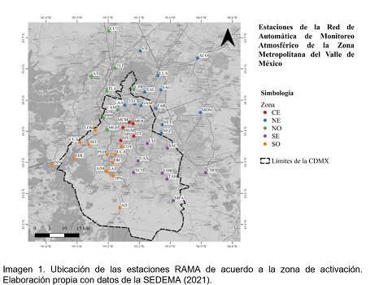

# Colección de datos

En la Ciudad de México, el **Sistema de Monitoreo Atmosférico** (`SIMAT`) es el encargado de realizar el monitoreo y difusión contínuo del estado de la calidad del aire en la **Zona Metropolitana del Valle de México** (`ZMVM`). Para esto, cuenta con sitios de monitoreo distribuidos en toda la zona, los cuales cuentan con equipo y especialistas que realizan un monitoreo continuo de contaminantes atmosféricos como el dióxido de azufre, monóxido de carbono, ozono y partículas suspendidas.  

El `SIMAT` se conforma de 4 subsistemas, la **Red Automática de Monitoreo Atmosférico** (`RAMA`), la **Red Manual de Monitoreo Atmosférico** (`REDMA`), la **Red de Meteorología y Radiación Solar** (`REDMET`) y la **Red de Depósito Atmosférico** (`REDDA`). 

`RAMA` realiza un monitoreo continuo de dióxido de azufre, monóxido de carbono, dióxido de nitrógeno, ozono, ![PM10] y ![PM2.5], otorgando un promedio horario de cada uno de estos datos.  
Los datos de ![PM10] y ![PM2.5] se presentan en unidades de ![medida], desde 1995 y 2003, respectivamente, utilizando el método de atenuación de radiación beta, que mide el grado de atenuación por las partículas depositadas sobre un filtro continuo _(Secretaría de Medio Ambiente de la Ciudad de México (SEDEMA, s.f.)_.  
Los datos de las concentraciones promedios horarias de ![PM10] y ![PM2.5] registrado en las estaciones RAMA de 2019 y 2020 fueron utilizadas para este estudio _(SEDEMA, 2020)_.  

Asimismo, la `SIMAT` ubica las estaciones de monitoreo de la `ZMVM` en 5 zonas: 
- `Noreste (NE)`
- `Noroeste (NO)`
- `Centro (CE)`
- `Sureste (SE)`
- `Suroeste (SO)`

Estas son llamadas zonas de activación que son utilizadas para determinar las fases de Contingencia Ambiental Atmosférica.  
Para efectos de este estudio, se descargaron los datos de la ubicación geográfica de cada estación de monitoreo y se clasificó según la zona a la que pertenece.  
La ubicación geográfica de las estaciones `RAMA` y su grupo de acuerdo a las zonas geográficas dentro de la `ZMVM` se encuentran en el siguiente mapa.

</div

[PM10]: https://latex.codecogs.com/gif.latex?\bg_white&space;PM_{10}
[PM2.5]: https://latex.codecogs.com/gif.latex?\bg_white&space;PM_{2.5}
[medida]: https://latex.codecogs.com/gif.latex?\bg_white&space;\mu&space;g&space;/&space;m^{3}