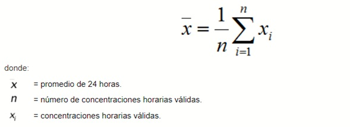
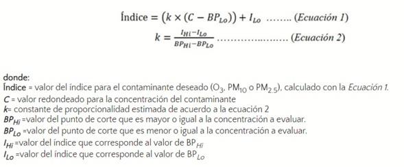
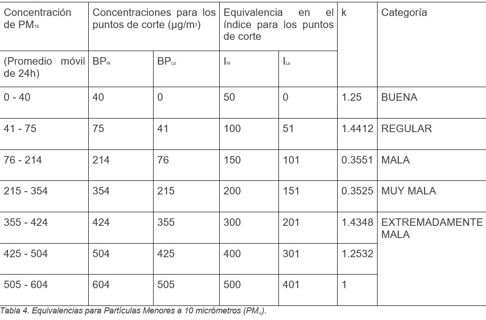
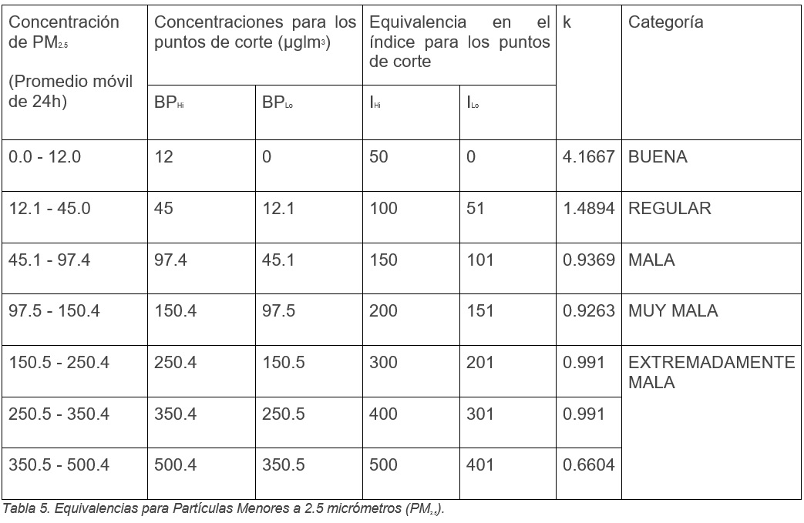

# Transformación, filtración y ordenamiento de datos

## OBJETIVO 

- Utilizar transformaciones de datos para limpiar y preparar un dataset para análisis.
- Realizar filtraciones para obtener conjuntos de datos.
- Reordenar datos para ver el conjunto desde diferentes perspectivas.

***

Para responder las preguntas claves o los objetivos planteados inicialmente, es necesario procesar los valores diarios de la base de datos.  
Primeramente se describe la metodología empleada para obtener:
1. Las concentraciones promedio diaria, 
1. La proporción de participación de las partículas y 
1. El cálculo del índice de calidad del aire

Esta metodología se aplicó a cada contaminante y a cada año estudiado.

***
## Metodología

### Promedio diario

Para el cálculo del promedio diario de ![PM10] y ![PM2.5] se utilizó la metodología descrita en la `NOM-025-SSA1-2014`, que establece que el promedio aritmético de **24 horas** podrá realizarse si por lo menos se cuenta con el **75%** de los datos, siguiendo la siguiente ecuación:

Para este caso, se seguirá el mismo principio, pero tomando todos los datos horarios de las estaciones de cada zona para tener un promedio diario por zona de cada contaminante. Los datos deben ser redondeados a 0 dígitos para el ![PM10] y a un dígito para el ![PM2.5].

### Índice de calidad del aire
El método para calcular el índice de calidad (`IQA`) del aire fue desarrollado por la **Agencia de Protección Ambiental** de los Estados Unidos (`EPA`, por sus siglas en inglés), con el objetivo de alertar a la población sobre la concentración de contaminantes atmosféricos _(U.S. Environmetal Protection Agency, 2018)_. El `IQA` para el ![PM10] y ![PM2.5] se realiza tomando en cuenta las concentraciones promedio diarias y siguiendo la siguiente ecuación:

Donde los límites del punto de corte están dados en la siguiente tabla, según las modificaciones indicadas por la `SEDEMA (2020)`.

***
## Aplicación de la metodología

Antes de aplicar la metodología se hicieron algunos ajustes en los Dataframes, con el motivo de un mejor manejo de los datos y que ayudarán a su uso posterior.

**NOTA: Debido a nuestra nueva estructura de datos, los datos `NaN` faltantes se pudieron eliminar en este apartado.**

La reorganización de los datos, donde ahora tendremos una columna para las estaciones y sus correspondientes datos de medición, con esto logramos una menor afectación en los datos al momento de la limpieza de `NaN's`.

Dicha reestructura y aplicación de la metodología, se segmentó por tipo de PM.

- [Transformación de datos PM10](https://github.com/IrvingC48/BeduFase2-Proyecto_python/blob/main/Procesos/6_1_Transformacion_PM10.ipynb)
- [Transformación de datos PM2.5](https://github.com/IrvingC48/BeduFase2-Proyecto_python/blob/main/Procesos/6_2_Transformacion_PM25.ipynb)

[PM10]: https://latex.codecogs.com/gif.latex?\bg_white&space;PM_{10}
[PM2.5]: https://latex.codecogs.com/gif.latex?\bg_white&space;PM_{2.5}
