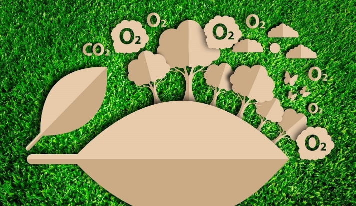

# Partículas suspendidas en la Zona Metropolitana del Valle de México durante el encierro de emergencia de 2020

## Equipo #16

1. [Contexto](#Contexto)
2. [Procesamiento del proyecto](#procesamiento-del-proyecto)
3. [Colaboradores](#colaboradores)

***

## Contexto

Proyecto BEDU de Calidad del Aire ZMVM en python

En el año 2020, comenzó la emergencia sanitaria mundial debido al virus COVID-19, por lo que varios países adoptaron medidas sanitarias preventivas, entre ellos los cierres de emergencia, donde cesaron gran parte de las actividades económicas. Debido a estas medidas en algunos países como Corea del Sur, China y Brasil, se presentaron cambios locales a corto plazo en la calidad del aire, especialmente en las concentraciones de las partículas suspendidas de 2.5 y 10 𝜇g ( ![PM2.5] y ![PM10] ).

Nuestro objetivo es evaluar los efectos que este aislamiento social provocó en la concentración de estas partículas en la Zona Metropolitana del Valle de México, comparando los datos registrados en 2019 y 2020.

En este repositorio se presentan todo los procedimientos aplicados desde la identificación e investigación del problema, hasta los procesos de adquisición, limpieza, filtrado y tratamiento de datos.

***
## Procesamiento del proyecto
1. [Identificación del problema](https://github.com/IrvingC48/BeduFase2-Proyecto_python/blob/main/Procesos/1_Identificacion_del_problema.md)
1. [Planteamiento de preguntas clave](https://github.com/IrvingC48/BeduFase2-Proyecto_python/blob/main/Procesos/2_Planteamiento_preguntas_clave.md)
1. [Colección de datos](https://github.com/IrvingC48/BeduFase2-Proyecto_python/blob/main/Procesos/3_Coleccion_de_datos.md)
1. [Análisis exploratorio de datos](https://github.com/IrvingC48/BeduFase2-Proyecto_python/blob/main/Procesos/4_Analisis_Exploratorio_Datos.ipynb)
1. [Limpieza de datos](https://github.com/IrvingC48/BeduFase2-Proyecto_python/blob/main/Procesos/5_Limpieza_de_datos_y_agregaciones.ipynb)
1. [Transformación de datos](https://github.com/IrvingC48/BeduFase2-Proyecto_python/blob/main/Procesos/6_Transformacion_de_datos)
1. [Uso de APIs (Opcional)](https://github.com/IrvingC48/BeduFase2-Proyecto_python/blob/main/Procesos/7_Uso_APIs.ipynb)
1. [Trabajo Futuro](https://github.com/IrvingC48/BeduFase2-Proyecto_python/blob/main/Procesos/8_Trabajo_Futuro.md)
1. [Referencias](https://github.com/IrvingC48/BeduFase2-Proyecto_python/blob/main/Procesos/9_Referencias.md)

***

## Colaboradores

- Jessica Guadalupe Tobal Cupul
- María Antonieta Gómez Ortiz
- Wilber Aldair Alegria Méndez
- Irving Cisneros Castillo

[PM10]: https://latex.codecogs.com/gif.latex?\bg_white&space;PM_{10}
[PM2.5]: https://latex.codecogs.com/gif.latex?\bg_white&space;PM_{2.5}